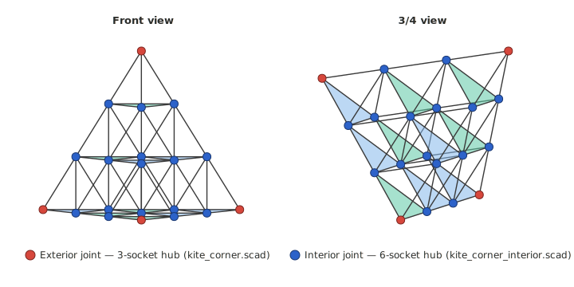
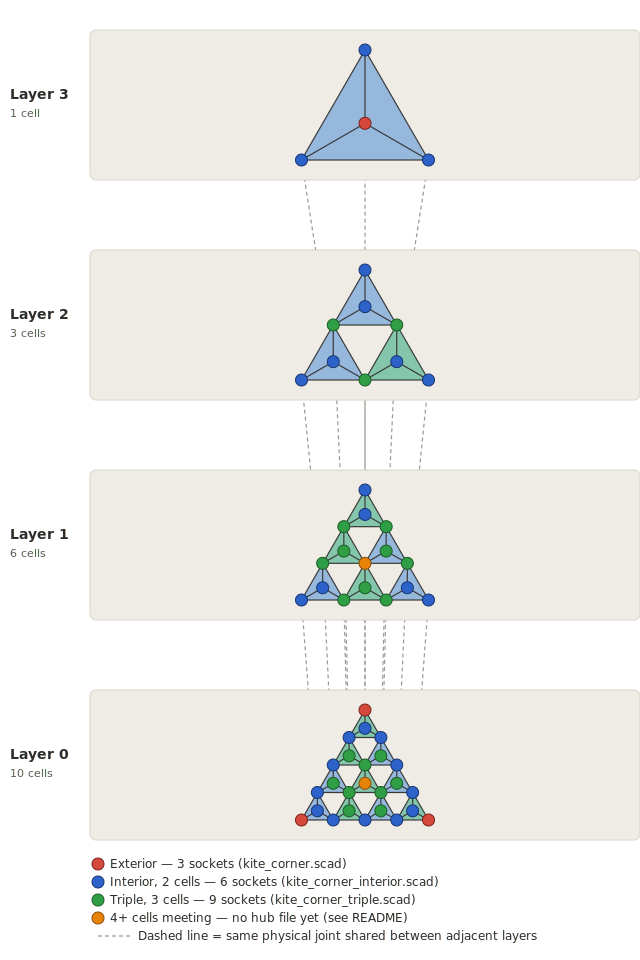

# Tetrahedral Kite Corners

**This is a separate hobby side-project, not part of the VINDSNURR wind rotor.**
It lives in this repository because it was inspired by the structural comparison
in [`../docs/kite-comparison.html`](../docs/kite-comparison.html), but the two
designs share nothing beyond "triangulated frames are rigid." Do not mix parts,
tolerances, or print settings between this directory and `../3d/`.

**Already built one and ready to fly it?** See [FLIGHT.md](FLIGHT.md) for
where to attach the line, how strong it needs to be, whether your build is
light enough, and wind/launch guidance.

---

## What this is

3D-printed corner connectors for building
[Alexander Graham Bell's tetrahedral kite](https://en.wikipedia.org/wiki/Tetrahedral_kite)
out of rigid struts instead of the classic straws-and-knotted-string build.
Bell's tetrahedral cell research (starting in the late 1890s) scaled all the
way up to real piloted flight: his *Frost King* prototype had about 1,300
cells, and a *Cygnet*-series kite with roughly 3,393 cells carried a man to
about 51m (168ft) above Baddeck Bay, Nova Scotia, on 6 December 1907 — see
[Wikipedia: Man-lifting kite](https://en.wikipedia.org/wiki/Man-lifting_kite)
for the documented history. This design is a small-scale hobby homage to that
structural idea, not a reproduction of Bell's specific kites.

Reference builds this design is informed by:
- [Instructables: Tetrahedral Kite](https://www.instructables.com/Tetrahedral-Kite-1/) — a 10-cell straws/string/tissue-paper build
- [Western Engineering Outreach: Tetrahedral Flight](https://www.eng.uwo.ca/outreach/files/STEM-Home/Week-7/W7-Tetrahedral-Flight.pdf) — a simpler 4-cell classroom-activity build, with an explicit rule worth keeping in mind for any layout: *"Tetrahedrons may only be connected at the corners, not along the edges or the faces"*
- [Building the Kono-Bell Tetrahedral Kite](https://booksbrassandthebear.wordpress.com/2017/07/05/building-the-kono-bell-tetrahedral-kite/) — describes the recursive scaling method Bell himself used: 4 cells make a kite, then that whole kite becomes one "cell" in a group of 4 for the next size up



*Front view and 3/4 view of a 4-layer, 20-cell arrangement (10 base cells + 6
+ 3 + 1). Deliberately taller than the classic 10-cell Instructables build,
because a 3-layer kite never produces a vertex where more than 2 cells meet
— you need at least 4 layers to see the full picture. Red = exterior joint,
blue = interior joint (2 cells), green = triple joint (3 cells), orange = a
vertex where 4 cells meet (confirmed to occur at this layer count, not yet
covered by any hub — see "Known limit" below). This is a schematic, not a
precision engineering drawing, but every vertex position and joint
classification was computed from real 3D coordinates (see "How many cells
can share one vertex?" below), not drawn freehand.*

**Bell's own large kites had far more layers than the small examples here**
(his *Frost King* and *Cygnet*-series kites had thousands of cells — see
"What this is" above) — so a faithful large-scale build needs to handle
triple joints, and potentially higher-order joints this repo doesn't cover
yet. If you're building something that large, read "Known limit" below
before you start printing hubs.

**Three hub designs, for three different vertex types (plus one more the
repo doesn't cover yet):**

| Hub | File | Sockets | Use for |
|-----|------|---------|---------|
| Exterior corner | `3d/kite_corner.scad` | 3 | Vertices touched by only one tetrahedral cell (the tips of the outermost cells) |
| Interior joint | `3d/kite_corner_interior.scad` | 6 (1 through-bore + 4 blind) | Vertices where exactly 2 cells meet corner-to-corner |
| Triple joint | `3d/kite_corner_triple.scad` | 9 (3 through-bores + 3 blind) | Vertices where exactly 3 cells meet corner-to-corner — only occurs in kites with 4+ layers |

A single tetrahedral cell only needs the exterior hub (4 per cell). A small
multi-cell kite (3 layers or fewer, like the classic 10-cell Instructables
build) only ever needs exterior and interior hubs. A taller kite (4+ layers)
will also need triple hubs at some vertices — see **Which hub goes where**
below for how to tell them apart in your layout, and **Known limit** for
what happens if your kite is tall enough to need even more.

## Files

| File | Purpose |
|------|---------|
| `3d/kite_corner.scad` | Exterior corner hub — 3 sockets at 60° |
| `3d/kite_corner_interior.scad` | Interior joint hub — 6 sockets (1 through-bore + 4 blind) for 2 cells meeting at a point |
| `3d/kite_corner_triple.scad` | Triple joint hub — 9 sockets (3 through-bores + 3 blind) for 3 cells meeting at a point |
| `3d/validate_and_export.sh` | Renders all three hubs to confirm they're clean manifold solids, then exports STL + 3MF at both the default and lightweight parameter presets |
| `3d/printable/` | Ready-to-print STL + 3MF output, default 6mm-rod preset (committed to the repo) |
| `3d/printable/lightweight/` | Ready-to-print STL + 3MF output, lightweight 4mm-rod preset for kites over ~1m — see [FLIGHT.md](FLIGHT.md) |
| `FLIGHT.md` | Where to attach the line, line strength, weight budget, wind speed, and launch guidance |
| `kite-diagram.svg` | Schematic diagram of a 4-layer, 20-cell kite, front + 3/4 view, joint types colour-coded |
| `generate_diagram.py` | Regenerates `kite-diagram.svg` from real 3D coordinates (see script docstring for the two output variants) |
| `kite-diagram-inline.svg` | Generated alongside `kite-diagram.svg` — an HTML fragment version for pasting into `docs/kite-comparison.html`, since a page-embedded `` can't follow that site's manual light/dark toggle |
| `kite-exploded.svg` | Exploded layer view — each of the 4 layers as a separate panel, bottom to top, with connector lines between shared joints |
| `generate_exploded_diagram.py` | Regenerates `kite-exploded.svg` (same two-variant pattern as `generate_diagram.py`) |
| `kite-exploded-inline.svg` | Generated alongside `kite-exploded.svg` — HTML fragment version for `docs/kite-comparison.html` |

## Just want to print? Skip OpenSCAD entirely

Ready-to-print **STL** and **3MF** files are already in
[`3d/printable/`](3d/printable/) — download the one(s) you need straight from
GitHub and load them into your slicer (Cura, PrusaSlicer, Bambu Studio,
Creality Print, etc. all read both formats natively). You don't need OpenSCAD
unless you want to change a dimension yourself.

## Software required (only if you're changing the design)

**OpenSCAD** (free) — https://openscad.org

```
cd kite-corners/3d
./validate_and_export.sh
```

Requires OpenSCAD on `PATH`. Exports land in `3d/printable/`. Re-run this
after any change to either `.scad` file and commit the result, so the
ready-to-print files always match the current source. If validation fails,
do not print the part — check the log printed to
`/tmp/kite_corner_validate_*.log` first.

Or manually: open a `.scad` file in OpenSCAD → **F6** to render → **File → Export**.
Increase `$fn` from 64 to 128 before exporting for final printing.

## How many cells can share one vertex? — how the geometry was derived

A regular tetrahedron's faces are all equilateral triangles, so **the angle
between any two struts meeting at a vertex is 60°** — not arccos(1/3) ≈ 70.53°,
which is a different quantity (the *dihedral* angle between two faces sharing
an edge). This was verified numerically: built a real unit-edge tetrahedron
from coordinates and measured the actual angle between edges at a vertex,
rather than trusting the formula from memory. If you've read an earlier
version of this file or `kite_corner.scad`, it used the wrong (70.53°) angle —
that bug is fixed as of this version.

**Interior joints (2 cells)** were derived the same way: built a real edge-2
tetrahedron, subdivided it at the edge midpoints into 4 unit sub-tetrahedra
(the standard construction for a multi-cell tetrahedral kite — cells meet
only at shared *vertices*, not shared edges, which is why it's light and why
the classic build "ties" cells together rather than doubling up struts).
Reading off the 6 real strut directions at one shared vertex showed that
**2 of the 6 are exactly opposite (180°)** — so `kite_corner_interior.scad`
models that pair as one continuous through-bore, with the other 4 as
separate blind sockets at 60°/120° to the bore axis.

**Triple joints (3 cells)** exist because a 2-layer or 3-layer kite is too
short to reveal them, but a taller one isn't: built a 4-layer, 20-cell
assembly (10 base + 6 + 3 + 1, each layer's base triangle anchored exactly to
the layer below's apex points — the same coordinate-anchoring approach as
the interior-joint derivation, just carried one layer further) and checked
*every* vertex in it, not just one. Result: 4 exterior vertices (1 cell), 18
interior vertices (2 cells) — and **12 vertices where exactly 3 cells meet**.
All 12 were confirmed to have identical geometry (same 15×60°, 6×90°, 12×120°,
3×180° angle signature, just rotated in space), so one hub design covers
every triple joint.

At a triple joint, 9 struts meet (3 cells × 3 struts each), splitting into
two clean symmetric groups verified by checking that a 120° rotation about
the hub's axis exactly maps each blind socket onto the next, and a 60°
rotation exactly maps each in-plane strut onto the next:
- **6 struts lie in one equatorial plane**, spaced every 60° — these pair up
  into **3 straight through-bores**.
- **3 struts point out of that plane** at 35.264° from the perpendicular
  axis, spaced every 120°, each sitting exactly between two of the in-plane
  struts — these are **3 separate blind sockets**.

## Known limit: 4+ cells meeting at one vertex

The same 20-cell check that found the 12 triple joints also found **1
vertex where exactly 4 cells meet** — confirmed by direct construction, not
a guess. At that vertex, 12 struts meet (4 cells × 3 struts each), and
**all 12 pair up into 6 straight through-bores with no blind sockets left
over** (verified: every strut has exactly one true opposite partner, and no
two struts from different cells point in the exact same direction).

**No hub file in this repo covers the 4-cell case yet.** It only shows up in
kites with enough layers stacked — a 3-layer kite (10 cells) never produces
one; a 4-layer kite (20 cells) produces exactly 1; taller kites will produce
more, and may even produce 5-cell, 6-cell, or higher vertices further in.
Bell's own large-scale kites (thousands of cells across many layers — see
"What this is" above) almost certainly needed this deeper into the
structure. If you're planning a kite tall enough to hit this, you'll need to
derive and print a dedicated 12-socket hub yourself using the same
approach documented above (build the real coordinates for your specific
layer count, find the vertex, read off the strut directions, check for a
120°/60°-style rotational symmetry to simplify the design) — do not assume
the triple-joint hub's pattern extrapolates without checking, since the
6-vs-9-strut cases already showed the strut/through-bore counts don't follow
a simple linear rule from cell count alone.

## Exploded layer view



The two-view diagram above shows the whole assembled shape at once. This
exploded view instead pulls each of the 4 layers apart vertically — useful
for planning which hub goes where, layer by layer, rather than puzzling
over the whole 3D structure at once. Dashed lines connect each vertex to
the matching joint in the layer directly above or below it — the same
physical point, shown once per layer it touches. Layer 0's own
interior/triple joints (where its 10 cells meet each other, within the
layer) use the same colour code as the dashed connector joints at its top
edge (where Layer 0 meets Layer 1) — the hub choice depends only on how
many cells share that specific point, not on which layer(s) it's between.

## Which hub goes where

The diagrams above show a 4-layer, 20-cell example (10 base cells + 6 mid +
3 + 1 top, forming one large tetrahedron overall) — tall enough to show all
three hub types at once:

- Every cell's **outward-facing tip** — untouched by any other cell — is an
  **exterior** vertex. Use `kite_corner.scad`.
- Every point where **exactly 2 cells** meet at a shared corner (a lower
  layer's apex resting under an upper layer's base corner) is an
  **interior** vertex. Use `kite_corner_interior.scad`.
- Every point where **exactly 3 cells** meet at a shared corner is a
  **triple** vertex. Use `kite_corner_triple.scad`. These only appear once
  your kite has 4 or more layers — a 3-layer, 10-cell kite (the classic
  Instructables build) never has one.
- If your kite is tall enough that **4 or more cells** meet at one point
  (confirmed to happen starting at 4 layers — see "Known limit" above),
  there is no hub file for that yet.

The classic 10-cell Instructables build (3 layers) only ever needs exterior
and interior hubs — you don't need `kite_corner_triple.scad` unless you're
building something taller.

**This isn't the only valid layout.** Bell's own kites — and the recursive
"4 cells make a kite, then 4 kites make the next size up" method described in
the Kono-Bell build log linked above — use a different overall shape, but the
same joint rule applies at every scale: hub choice depends only on how many
cells meet at that specific vertex (1, 2, 3, or more), not on which overall
layout you're building. The joint angles don't change with scale — only the
strut length does, which is why all three hub files expose
`strut_d`/`strut_depth` as parameters rather than hardcoding one size.

Work out the exact hub count and vertex types for your specific layout
before printing — it depends on how many cells you connect, how many layers
tall the kite is, and exactly which vertices are shared. When in doubt,
dry-fit the whole frame with tape or string first, same as the
test-jig-first approach in the main VINDSNURR project — and count how many
cells actually meet at each corner before assuming it's an interior (2-cell)
joint.

## Assembly — building a cell and joining cells

The steps below follow the same build sequence as the
[Western Engineering Outreach activity](https://www.eng.uwo.ca/outreach/files/STEM-Home/Week-7/W7-Tetrahedral-Flight.pdf)
(single cell → 4-cell kite → cover → fly), adapted for rigid struts and
printed hubs instead of straws and thread.

### 1. Cut your struts

All struts in one cell must be the **same length** — pick a length (150–250mm
is a comfortable hobby size) and cut 6 struts of 6mm dowel, fiberglass, or
carbon rod to that length, with clean square-cut ends. Every strut in the
kite should be this same length unless you're deliberately mixing cell sizes.

### 2. Print a test piece first

Before printing a full set of hubs, print **one** exterior hub
(`kite_corner.scad`) and test-fit a strut in each of its 3 sockets:

- **Too tight** — increase `strut_tol` (default 0.3mm) and reprint
- **Too loose / wobbles** — decrease `strut_tol` and reprint
- **Correct** — strut slides in with light finger pressure, no wobble, no force needed

Once the fit is right, do the same check with one interior hub
(`kite_corner_interior.scad`) — it uses the same `strut_tol`, but confirm the
through-bore and the 4 blind sockets all take the strut the same way. If
your kite is 4+ layers and will need triple hubs, test-print one
`kite_corner_triple.scad` too before committing to a full print run.

### 3. Build one tetrahedral cell

A single cell needs **4 exterior hubs and 6 struts**:

- Glue (or press-fit, if your tolerance is snug enough) 3 struts into 3
  sockets of one hub — this is one **base corner**.
- Do the same for 2 more hubs, so you have 3 hubs each holding 3 struts,
  radiating outward.
- Bring the 3 free strut ends together and join them with a 4th hub — this
  closes the triangular base and forms the **apex**.
- Check: you should now have a rigid 4-hub, 6-strut tetrahedron that doesn't
  flex or rack when you squeeze it. If it flexes, a strut is loose in its
  socket — re-glue that joint before continuing.

Cover 2 of the 4 faces with a lightweight sail material (ripstop nylon,
tissue paper, or plastic sheeting all work — this is a low-load hobby part,
so covering choice is about weight and looks, not strength). Leave the other
2 faces open, same as the reference builds.

### 4. Join cells at shared corners — never along an edge or face

This is the one rule to get right, confirmed independently by every
reference build linked above: **cells connect only by sharing a single
corner vertex.** Never glue two cells' struts side-by-side along a shared
edge, and never overlap their faces.

To join a second cell to the first:

- Pick one corner (hub) of the first cell to be a **shared vertex**.
- Build the second cell the same way as step 3, but instead of closing its
  last corner with a fresh exterior hub, close it into an
  **interior hub** (`kite_corner_interior.scad`) that is *also* one of the
  first cell's corners.
- In practice: replace the exterior hub at that one shared corner with an
  interior hub before you glue the struts in. Each cell contributes exactly
  3 struts to the shared hub. One strut from the first cell and one strut
  from the second cell happen to point in exactly opposite directions once
  both cells are in place — those two go in the interior hub's single
  through-bore (one from each end). The remaining 2 struts from each cell
  (4 total) go in the 4 separate blind sockets.
- Every other corner of both cells — the ones not shared — stays an
  **exterior** hub.

Repeat for however many cells your layout needs, replacing an exterior hub
with an interior hub every time two cells meet at a corner — and with a
triple hub (`kite_corner_triple.scad`) if your kite is tall enough that
three cells end up sharing one corner (4+ layers; see "Known limit" above
if you're going even taller than that). See **Which hub goes where** above
for how the 20-cell example layout breaks down.

### 5. Attach the flight line and fly

**Attach to one of Layer 0's 3 base-corner exterior hubs — never the top
apex.** In the exploded-view diagram above, that's one of the 3 red dots
at the very bottom row of Layer 0 (the same 3 vertices shown as the outer
tips of the whole triangle in the front-view diagram). Any one of the 3
works — pick the one at a corner cell whose 2 outward-facing side faces
are both covered with sail.

Why the base, not the top: an exterior hub is the lowest-stress joint
(only 3 sockets, so tying a line there loads it in pure tension along
already-loaded strut axes), and Layer 0's base corners sit at the front
edge of the kite where both adjacent faces are on the outer surface —
never hidden against a neighboring cell. The top apex is also an exterior
vertex, but it's at the back/top of the assembly, not the front, and every
reference build (Instructables, Kono-Bell) attaches at a front-bottom
corner, not the tip.

Tie (or loop through a small eyelet you print or drill into that hub) the
flight line there. Balance-test by hand in light wind before committing to
a long flight line; if the kite won't stay stable, re-check the belt/edge
connectivity against your layout diagram before assuming the sail
placement is wrong. See [FLIGHT.md](FLIGHT.md) for wind speed, line
strength, and launch guidance once your kite is assembled.

## Build size

| Structure | Exterior hubs | Interior hubs | Triple hubs | Struts |
|-----------|---------------|----------------|-------------|--------|
| 1 tetrahedral cell (standalone) | 4 | 0 | 0 | 6 |
| 3-layer, 10-cell kite (Instructables build) | varies by layout — outward tips only | varies by layout — one per 2-cell contact point | 0 (never occurs at 3 layers or fewer) | 6 per cell |
| 4+ layer kite | varies by layout | varies by layout | varies by layout — appears starting at 4 layers | 6 per cell |

Work out your specific layout's counts as described in "Which hub goes
where" above — these don't follow a simple formula from cell count alone.

## Parameters

All three files share the same parameter names:

| Parameter | Default | Meaning |
|-----------|---------|---------|
| `strut_d` | 6.0mm | Strut outer diameter — sized for 6mm dowel, fiberglass, or carbon rod |
| `strut_tol` | 0.3mm | Socket clearance — adjust per printer until struts slide in with light finger pressure |
| `strut_depth` | 16.0mm | Blind socket depth |
| `hub_r` | 12.0mm (exterior) / 14.0mm (interior) / 16.0mm (triple) | Hub sphere body radius — larger hubs have more openings |
| `wall` | 2.5mm | Minimum wall thickness |

This is a **low-load hobby part** — a kite's tether and wind loads are far
lighter than VINDSNURR's continuous rotational loads, so 15–20% infill and
2 wall perimeters in PLA are enough. No bearing, no shaft, no calibration jig
needed — just print a test piece first and check the strut fit.

## Print settings

| Setting | Value |
|---------|-------|
| Material | PLA (indoor kite), PETG if it'll live outdoors |
| Infill | 15–20% |
| Layer height | 0.2mm |
| Walls | 2 perimeters minimum |
| Supports | Exterior hub: not required. Interior hub: recommended for the 4 angled sockets. Triple hub: recommended for the 3 angled sockets. |

---

Open source · MIT licence (same as the parent repository)
