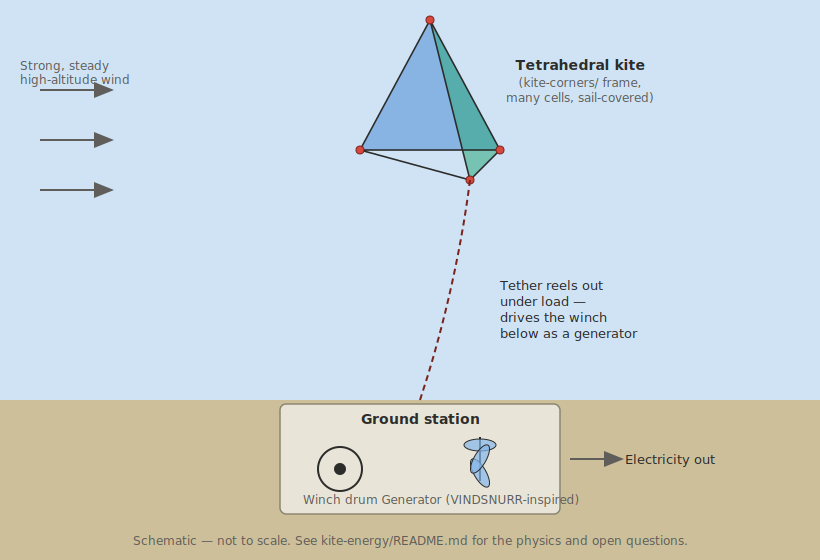

# Kite + VINDSNURR: An Exploratory Combination

**This is a speculative exploration, not a build guide.** Nothing here has
been prototyped, and several open questions are flagged explicitly rather
than answered. It combines two existing, separately-real ideas in this
repository — the [`kite-corners/`](../kite-corners/) tetrahedral kite and
VINDSNURR's rotor concept — into a third idea neither one implies on its
own: could a tetrahedral kite structure, flown on a long tether, generate
usable electricity?

**Short answer: yes, in principle, via a real and already-existing
approach called Airborne Wind Energy (AWE) — but not by putting VINDSNURR's
actual rotor in the air.** The physically coherent version keeps
generation on the ground.

---

## Two ways to combine "kite" and "power," and why only one fits

There are two genuinely different architectures in real AWE research:

1. **Ground-generation (pumping kite)** — the kite flies and pulls the
   tether; a ground-based winch/generator converts tether tension and
   reel-out speed into electricity. This is how SkySails, Kitepower, and
   most current AWE systems work.
2. **Fly-generation (airborne turbine)** — small turbines mounted *on* the
   flying structure generate power in the air, sent down an electrical
   (not just mechanical) tether. This is how Google's Makani worked — but
   Makani used a rigid wing with lift-type propeller/turbines, not a soft
   cellular kite with a drag-type rotor.

VINDSNURR is a **ground-mounted, drag-type Savonius-style rotor** — heavy
and bulky relative to its swept area compared to the lift-type rotors
real fly-gen systems use, and it isn't designed to fly at all. Putting an
actual VINDSNURR rotor airborne would mean redesigning it from scratch as
a lightweight lift-type turbine — a different project. **This exploration
uses architecture 1**: the tetrahedral kite flies, a ground station
(inspired by VINDSNURR's rotor, but not VINDSNURR itself) generates the
power.

Sources for how real systems work: [arXiv: Flight control of tethered kites in autonomous pumping cycles](https://arxiv.org/pdf/1409.3083), [Knowable Magazine: Could high-flying kites power your home?](https://knowablemagazine.org/content/article/technology/2022/could-high-flying-kites-power-your-home), [IEEE Spectrum: Flying Kites Deliver Container-Size Power Generation](https://spectrum.ieee.org/micro-wind-power-kitepower), [TU Delft: 13 years of Makani airborne wind energy knowledge](https://www.tudelft.nl/en/2020/lr/13-years-of-makani-airborne-wind-energy-knowledge-available-open-source).

---

## How it would actually generate power: the pumping cycle

1. **Power phase** — the kite is flown crosswind (a figure-eight or
   circular path), which multiplies the apparent wind speed the kite
   experiences far beyond the actual wind speed. This pulls the tether out
   under high tension, spinning the ground-station winch, which drives a
   generator.
2. **Retraction phase** — the kite is pitched edge-on to the wind (using
   its bridle, if it has one — see "Steering" below), collapsing the pull
   to nearly zero, and a small motor reels the tether back in using only a
   fraction of the energy just generated.

Net power = energy generated in phase 1 minus energy spent in phase 2.
This is exactly how real systems like Kitepower's Falcon work.

---

## Raising and lowering: launch, altitude, and recovery

**Launch is passive, wind-lofted — the same 2-person launch already in
[`kite-corners/FLIGHT.md`](../kite-corners/FLIGHT.md)**, not a powered
vertical takeoff. A soft cellular kite has no onboard motors; adding them
(as Makani did, with propellers that doubled as turbines) would mean a
fundamentally different, rigid, motorized airframe — a different project,
not a variant of this one.

**Raising to altitude:** once airborne, gaining height is simply reeling
out more tether while the kite holds a stable flying angle — no different
in principle from flying any kite higher.

**Lowering:** reduce the tether angle while depowering (pitch the kite
more edge-on to the wind, the same mechanism as the retraction phase
above), then winch down under reduced tension. Never winch down a
fully-powered kite under full load — that's how lines snap or ground
crews get hurt.

### Why altitude actually matters here — this part is real, published science

Wind speed increases with height following the atmospheric boundary-layer
power law, and wind *power* scales with the **cube** of wind speed, so the
gains compound fast:

| Height | Wind speed (vs. 10m reference) | Power density (vs. 10m reference) |
|---|---|---|
| 10m | 1.00x | 1.00x |
| 50m | 1.29x | 2.17x |
| 100m | 1.45x | 3.02x |
| 200m | 1.61x | 4.21x |
| 500m | 1.87x | 6.54x |
| 1000m | 2.09x | 9.12x |

(Standard power-law wind profile, shear exponent 0.16 for open terrain —
a widely used estimate, not measured for any specific site.) This is
the core motivation for AWE generally: a kite at a few hundred meters can
access meaningfully stronger, steadier wind than a ground-mounted turbine
of any practical height, including VINDSNURR's own support-frame mast.

---

## Steering, height, and direction control — a real limitation of this design

**As designed, this kite has no steering.** [`kite-corners/README.md`](../kite-corners/README.md)'s
assembly guide attaches the flight line to a single exterior hub — a
classic single-line kite, which holds a stable angle in the wind but
cannot be actively steered into a crosswind figure-eight path. Real
power-generating kites use **multi-line bridles** — typically 2-4 lines to
different attachment points, with asymmetric pulling for steering
(left/right) and symmetric pulling for depower (collapsing pull to nearly
zero for the retraction phase).

To actually fly the pumping cycle described above, this design would need:

- **At least 2 additional lines** to other exterior hubs (front-left and
  front-right corners, alongside the current single attachment point),
  so pulling one vs. the other steers the kite
- **A ground-side control mechanism** (either a human "kite-steering bar"
  like sport kiteboarding, or a small powered actuator system for
  autonomous flight, as real AWE systems use)
- Height/direction in flight is then a function of steering input plus
  reel speed, not a separate control — same as any modern sport kite

This is a real, unaddressed gap between the current single-line assembly
guide and what a genuine power-generating version would need. It's a
natural next step for this exploration, not solved here.

---

## Gusts, tether tension, and why single-line is a real weakness

Tether tension responds to gusts differently depending on tether length
and whether the kite can depower:

- **A longer tether** generally has more line stretch to absorb a sudden
  gust (more compliance = lower peak tension spike), but reacts more
  slowly to control inputs, since it takes longer for a steering pull at
  the ground to reach and reorient the kite.
- **A shorter, tauter tether** transmits gust spikes more directly and
  sharply into the structure, but responds faster to steering.
- **A depower-capable (multi-line) kite** can actively "spill" a gust —
  pull the depower line to reduce the angle of attack the instant tension
  spikes — which is exactly why real AWE kites are never single-line.

**Our single-line design has no active gust response at all.** A gust
simply increases tension on the one line and loads the one exterior
attachment hub directly, with no mechanism to shed it except line stretch
and structural margin. This is consistent with the wind-range ceiling
already recommended in FLIGHT.md (avoid above ~28-30 km/h) — that ceiling
is doing double duty as a crude gust-safety margin in the absence of any
real depower control.

---

## Could a man-carrying-scale kite also carry wind-turbine hardware?

Bell's real 1907 Cygnet-series kite (documented history, already cited in
[`kite-corners/README.md`](../kite-corners/README.md)) weighed about 90kg
and carried a person of comparable weight — its structure carried roughly
its own mass again as payload. That's a real, achieved data point, not a
guess.

For our design, scaling the lightweight-preset numbers from FLIGHT.md to
a genuinely large kite:

| Base width | Structure mass (lightweight preset) | Sail area |
|---|---|---|
| 4m | ~1.3 kg | 13.9 m² |
| 8m | ~3.8 kg | 55.4 m² |
| 12m | ~7.6 kg | 124.7 m² |

**Important caveat:** the "payload budget" numbers in earlier drafts of
this kind of estimate conflate *tether pull force* (from the crosswind
power formula) with *sustained lift capacity for carrying dead weight* —
those are not the same calculation, and this document does not have a
trustworthy answer for how much stationary weight this kite shape could
actually carry aloft. A tetrahedral cellular kite is not an airfoil in the
aeronautical sense (it has no real angle-of-attack-driven lift like a
wing); its aerodynamic force is closer to a large, efficient drag sail. A
genuine "how much can it carry" answer needs real lift/drag wind-tunnel
or CFD data for this specific cell geometry — treat any number here as
unverified.

**What is a reasonable, low-risk answer:** don't try to carry actual
VINDSNURR-scale rotor hardware (which is designed to be heavy and
rigid — the opposite of what a kite needs) on the kite itself. If the goal
is "wind infrastructure aloft," the honest, buildable version is
architecture 1 above: keep the generation hardware on the ground, and let
the kite carry only itself, the tether, and control-line hardware.

---

## Best arrangement of kite elements to support "circular turbine elements"

If the goal is a rotor-like element flying as part of the kite (rather
than on the ground), the tetrahedral cell structure's own geometry
suggests where it's structurally sensible to mount one — **not** where it
would actually work aerodynamically (that's the open question above):

- **A ring-shaped rotor could sit around the belt** between the upper and
  lower rings of a hexagonal-bicupola-style arrangement (borrowing
  VINDSNURR's own belt/ring geometry concept), using the kite's own
  interior/triple joints as mounting points, since those are already the
  most reinforced hubs in the structure (6 or 9 sockets, vs. 3 for an
  exterior hub).
- **A single rotor at the kite's central axis**, geometrically similar to
  how VINDSNURR mounts its shaft through Hub T/Hub B, could reuse that
  same bearing-and-shaft concept — but would need the whole tetrahedral
  frame stiffened well beyond the current lightweight preset to resist
  the gyroscopic and torque loads of a spinning mass in a moving,
  flexing kite frame, which is a substantial structural redesign, not a
  parameter tweak.

Both of these are geometry-based placement suggestions only — neither has
been checked against real aerodynamic or structural loads for a rotating
mass in flight. Flag this as the single biggest open question in this
whole exploration if anyone picks it up.

---

## Could birds land on it?

Short answer: not realistically **in flight**. During the power phase the
kite is moving at real airspeed through a crosswind path; during any phase
the sail surfaces flex in wind, and there's no stationary perch. The
open (uncovered) faces expose bare strut edges, which also don't offer a
comfortable grip. This is more of a **ground-storage/handling**
consideration (a parked, unflown kite lying on the ground is just a large
static object, like any lawn furniture a bird might land on) than an
in-flight safety concern.

---

## Best-case power estimate

Using the standard crosswind-kite power formula (P ≈ (2/27)·ρ·A·v³·Cl·(L/D)²,
the same order-of-magnitude equation used throughout the AWE literature
already cited above — not a measured result for this specific design), for
a 12m-base kite (124.7 m² sail area) in 28 km/h wind:

| Aerodynamic quality (L/D) | Theoretical peak power | Realistic net average (30-50% of peak, accounting for the retraction phase and losses) |
|---|---|---|
| 2 (as-built, loose cellular sail — honest baseline) | ~17 kW | ~5-9 kW |
| 4 (optimistic — taut/semi-rigid panels) | ~68 kW | ~20-34 kW |
| 6 (best case — significant aero refinement) | ~153 kW | ~46-77 kW |

**Sanity check against a real system:** Kitepower's Falcon (a real,
flying, commercially-developed AWE kite, ~60m² area) is rated around 30kW
average output. Our 125m²-kite optimistic estimate (20-34kW) landing in
the same order of magnitude as a real system roughly half our kite's area
is a reasonable cross-check — not proof this specific tetrahedral design
would perform that well, since L/D=4 assumes aerodynamic refinement this
loose-cell, partially-covered design doesn't currently have.

**The honest baseline (L/D=2, this design as actually specified) gives
5-9 kW** — real, useful power at a genuinely large (12m) scale, but far
below the optimistic numbers, and achieving even that requires solving
the steering problem above first, since none of this works without a
multi-line, actively-flown kite.

---

## Summary of open questions, if anyone wants to take this further

- [ ] Design a multi-line bridle/steering system — the single biggest gap
      between "this could work" and "this actually flies a pumping cycle"
- [ ] Get real lift/drag data for the tetrahedral cell shape (wind tunnel
      or CFD) — the payload and L/D numbers above are order-of-magnitude
      estimates, not measurements
- [ ] Design an active or passive gust-depower mechanism
- [ ] If pursuing a flying rotor instead of ground-gen: a full redesign of
      VINDSNURR's rotor as a lightweight lift-type turbine, plus an
      electrical (not just mechanical) tether — a different project
- [ ] Structural analysis for a rotating mass mounted on a flexing kite
      frame, if pursuing the "circular turbine element" placement above

---

Open source · MIT licence (same as the parent repository)
